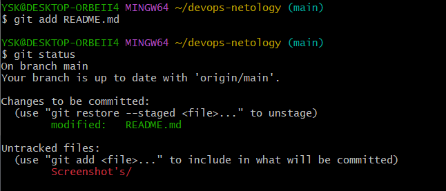
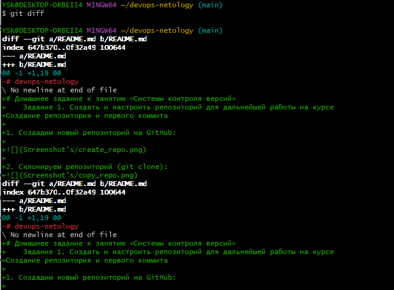

# Домашнее задание к занятию «Системы контроля версий»
    Задание 1. Создать и настроить репозиторий для дальнейшей работы на курсе
Создание репозитория и первого коммита

1. Создадим новый репозиторий на GitHub:

2. Склонируем репозиторий (git clone):

3. Так как я уже настраивал имя пользователя и email пользователя, я выведу их командами (git config user.name)&(git config user.email):

4. Переведем файл README.md в состояние modified. Для этого произведем изменения в файле README.md и выполним команду git status:

после выполнения команды (git status) видно что, git присвоил статус modified файлу README.md
5. Далее я ввел команду (git diff) и (git diff --staged) но, так как я не понимал сути этих команд ввел их одну за одной)

разобравшись в смылсе этих команд понял, что команда (git diff) необходима для того что бы просмотреть изменения до внесения в стейджинг, поэтому команда (git diff --staged) не вывела никаких результатов. Команда (git diff --staged) необходима для сравнения изменений внесенных в стейджинг с последним коммитом.
6. Произведя изменения в файле README.md переведем этот файл в состояние стейджинг командой (git add):

Можем видеть что файлу README.md присвое статус modified, а папка Screenshot's находиться в состоянии Untracked так как, она была создана после создания репорзитория.
7. Теперь повторно введем команду (git dif --staged) и получим следующий ввывод:

Видим что команда показывает какие изменения быле внесены между стейджингов.
8. Выполним коммит c коментарием командой (git commit -m 'First commit'), но так как я не внес в стейджинг папку со скриншотами, мне пришлось делать коммит два раза. Следующий коммит был с коминтарием (First commit + screenshot) 