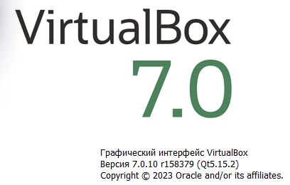
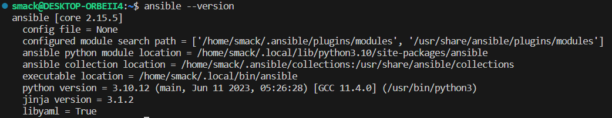

Домашнее задание к занятию 2. «Применение принципов IaaC в работе с виртуальными машинами»

Задача 1

1) Опишите основные преимущества применения на практике IaaC-паттернов.

    IaaC (Infrastructure as Code) - это методология, которая предусматривает автоматизированное создание, управление и развертывание IT-инфраструктуры и сервисов с использованием кода. Основные преимущества применения IaaC на практике:
    Стандартизация: IaaC предоставляет единый подход к управлению инфраструктурой, основанный на использовании кода, что позволяет стандартизировать процессы и упрощать их понимание и поддержку.
    Автоматизация: IaaC позволяет автоматизировать рутинные задачи по управлению инфраструктурой, снижая вероятность ошибок и экономя время.
    Повторное использование: IaaC упрощает процесс повторного использования кода при создании и управлении инфраструктурой, что позволяет сократить время на разработку и улучшить качество решений.
    Версионирование: IaaC обеспечивает версионирование инфраструктуры и возможность отката к предыдущим версиям в случае возникновения проблем.
    Управление изменениями: IaaC помогает контролировать и управлять изменениями в инфраструктуре, предоставляя возможность предварительно тестировать изменения перед их развертыванием.
    Масштабируемость: IaaC делает инфраструктуру более гибкой и масштабируемой, позволяя легко добавлять новые ресурсы и адаптировать систему к изменяющимся требованиям.

2) Какой из принципов IaaC является основополагающим?

    Основополагающим принципом IaaC можно считать принцип автоматизации, так как он позволяет значительно упростить и ускорить процессы управления инфраструктурой, снизить вероятность ошибок и повысить эффективность работы.

Задача 2

1) Чем Ansible выгодно отличается от других систем управление конфигурациями?

    Ansible выгодно отличается от других систем управления конфигурациями простотой использования, гибкостью, производительностью, масштабируемостью, безопасностью, а также тем, что он является бесплатным и открытым ПО не требующим установки агентов на конфигурируемые компьютеры.

2) Какой, на ваш взгляд, метод работы систем конфигурации более надёжный — push или pull? 

    Оба метода — push и pull — имеют свои преимущества и недостатки в зависимости от конкретной ситуации.
    Метод push (когда система управления конфигурацией отправляет изменения на управляемые узлы) может быть более надежным, так как позволяет контролировать процесс обновления и гарантирует, что все узлы будут обновлены одинаково. Однако этот метод может создавать дополнительную нагрузку на систему управления конфигурацией и управляемые узлы.
    Метод pull (когда управляемые узлы запрашивают изменения с сервера) может быть менее надежным, так как зависит от того, насколько часто узлы проверяют наличие обновлений. Однако этот метод может быть более эффективным, так как не создает дополнительной нагрузки на систему управления конфигурацией.
    В целом, выбор между push и pull методами зависит от требований к надежности, производительности и сложности системы.

Задача 3

Установите на личный компьютер:

VirtualBox,

Vagrant,

Terraform версии 1.5.Х (1.6.х может вызывать проблемы с яндекс-облаком),

Ansible.

Задача 4

Проверим установку докера командой (docker ps).
  

