# Домашнее задание к занятию «Системы контроля версий»
# Создать и настроить репозиторий для дальнейшей работы на курсе
Создание репозитория и первого коммита

1. Создадим новый репозиторий на GitHub:

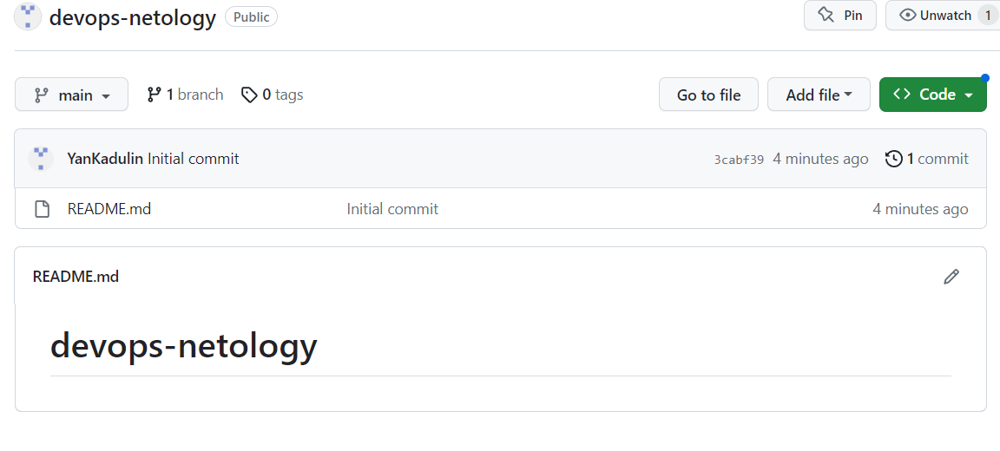

2. Склонируем репозиторий (git clone):

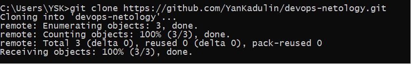
3. Так как я уже настраивал имя пользователя и email пользователя, я выведу их командами (git config user.name)&(git config user.email):

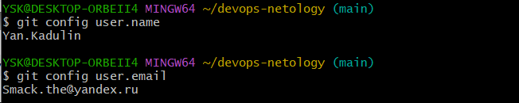
4. Переведем файл README.md в состояние modified. Для этого произведем изменения в файле README.md и выполним команду git status:

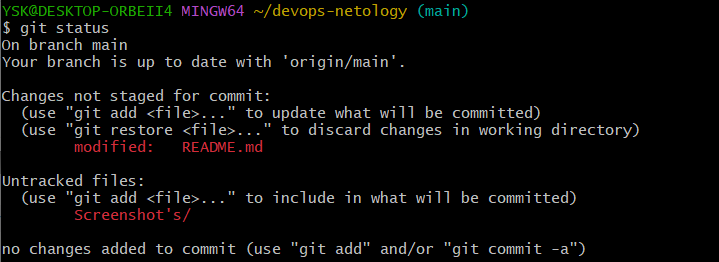
после выполнения команды (git status) видно что, git присвоил статус modified файлу README.md
5. Далее я ввел команду (git diff) и (git diff --staged) но, так как я не понимал сути этих команд ввел их одну за одной)

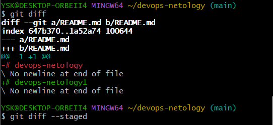

разобравшись в смылсе этих команд понял, что команда (git diff) необходима для того что бы просмотреть изменения до внесения в стейджинг, поэтому команда (git diff --staged) не вывела никаких результатов. Команда (git diff --staged) необходима для сравнения изменений внесенных в стейджинг с последним коммитом.
6. Произведя изменения в файле README.md переведем этот файл в состояние стейджинг командой (git add):

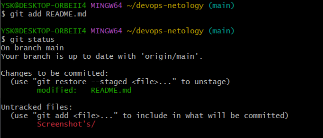
Можем видеть что файлу README.md присвое статус modified, а папка Screenshot's находиться в состоянии Untracked так как, она была создана после создания репорзитория.

7. Теперь повторно введем команду (git dif --staged) и получим следующий ввывод:
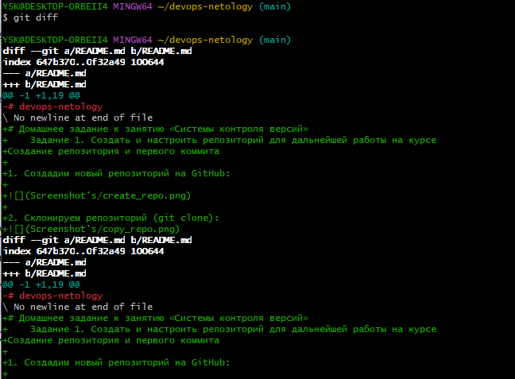
Видим что команда показывает какие изменения быле внесены между стейджингов.

8. Выполним коммит c коментарием командой (git commit -m 'First commit'), но так как я не внес в стейджинг папку со скриншотами, мне пришлось делать коммит два раза. Следующий коммит был с коминтарием (First commit + screenshot):
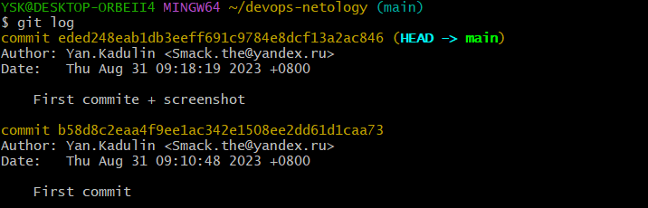

# Создание файлов .gitignore и второго коммита
1. Создадим файл .gitignore командой (touch .gitignore) и проверим успех выполнения команды другой командой (ls -a), ну или включим функцию просмотра скрытых файлов в папках.
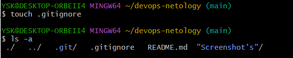
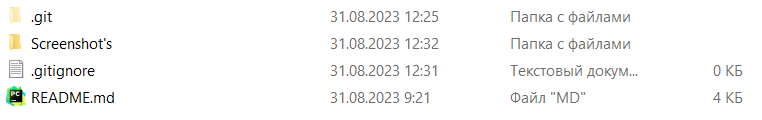
2. Добавляем файл .gitignore в следующий коммит (git add .gitignore) и проверяем командой (git status) в каком состоянии файл .gitignore
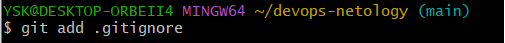
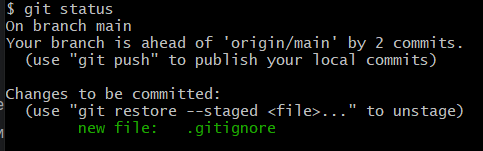
3. Создадим папку terraform командой (mkdir terraform) и так же проверим выполнение команды с помощью команды (ls -a)
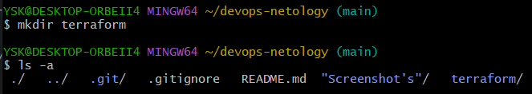
Видим что мы успешно создали папку под названием terraform
4. Создадим файл .gitignore в папке terraform и отредактируем его с помощью редактора nano, вставим в файл записи из [Terraform.gitignore](https://github.com/github/gitignore/blob/main/Terraform.gitignore)
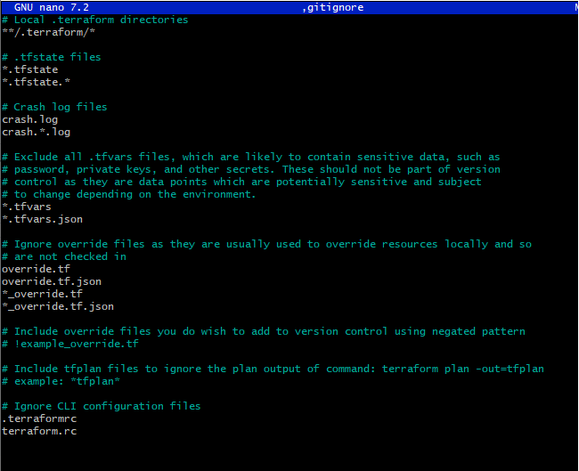
Из вставленных записей можем видеть что в будущем мы с помощью этого файла будем игнорировать файлы:

    /.terraform/ - Это локальные папки terraform;

    .tfstate - файлы состояний;

    .crash.log - файлы ошибок; 

    .tfvars - файлы с личной информацией;

    override.tf - я не знаю зачем они нужны

    .terraform.rc - файлы конфигурации сети
5. Внесем все изменения в стейджинг с помощью команды (git add)
6. Закомитим все наши изменения c коментарием added gitignore помощью команды (git commit -m 'added gitignore')
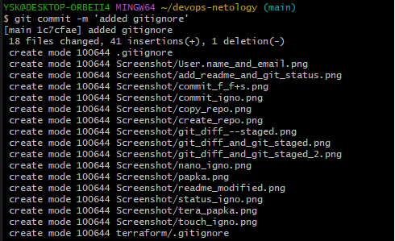

# Эксперимент с удалением и перемещением файлов (третий и четвёртый коммит)

1. Создадим файлы will_be_deleted.txt (с текстом will_be_deleted) и will_be_moved.txt (с текстом will_be_moved) и закоммитем их с комментарием Prepare to delete and move.
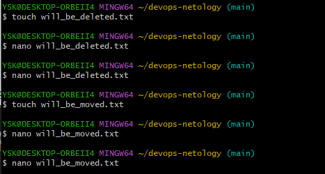
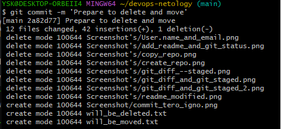
2. Удалим файл will_be_deleted.txt командой (rm)
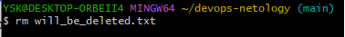
3. Переименуем файл will_be_moved.txt на has_been_moved.txt командой (mv)
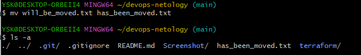
4. Закомитем все изминения с комментарием Moved and deleted
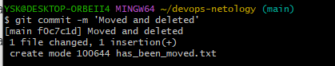
# Проверка изменения

Проверяем все внесенные изменения командой (git log)
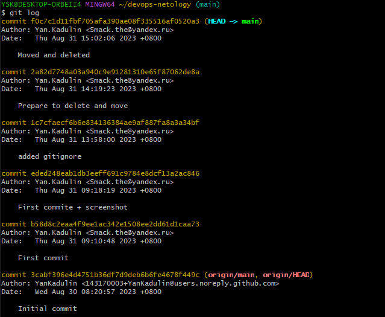
