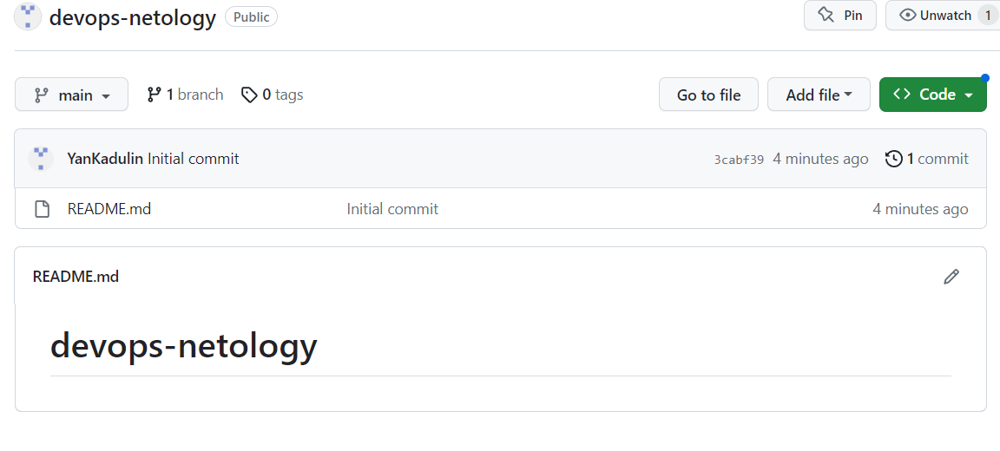
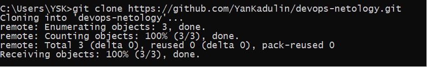
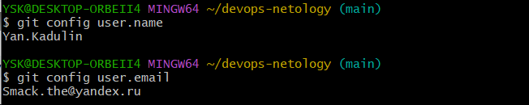
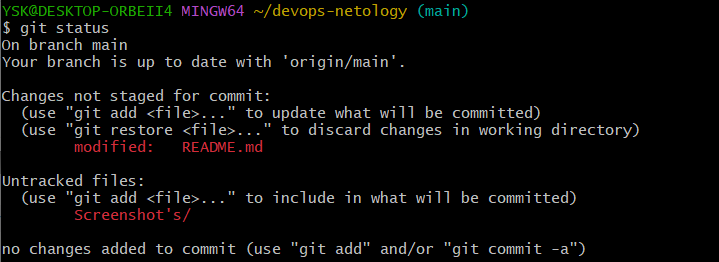
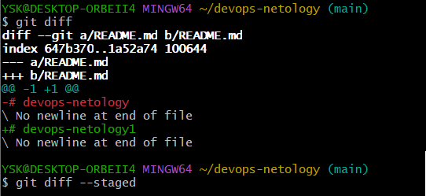

# Домашнее задание к занятию «Системы контроля версий»
    Задание 1. Создать и настроить репозиторий для дальнейшей работы на курсе
Создание репозитория и первого коммита

1. Создадим новый репозиторий на GitHub:

2. Склонируем репозиторий (git clone):

3. Так как я уже настраивал имя пользователя и email пользователя, я выведу их командами (git config user.name)&(git config user.email):

4. Переведем файл README.md в состояние modified. Для этого произведем изменения в файле README.md и выполним команду git status:

после выполнения команды (git status) видно что, git присвоил статус modified файлу README.md
5. Далее я ввел команду (git diff) и (git diff --staged) но, так как я не понимал сути этих команд ввел их одну за одной)

разобравшись в смылсе этих команд понял, что команда (git diff) необходима для того что бы просмотреть изменения до внесения в стейджинг, поэтому команда (git diff --staged) не вывела никаких результатов. Команда (git diff --staged) необходима для сравнения изменений внесенных в стейджинг с последним коммитом.
6. 