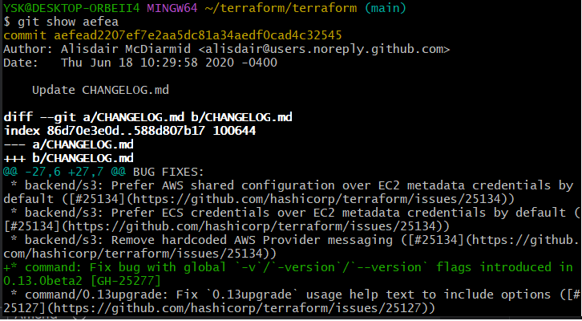
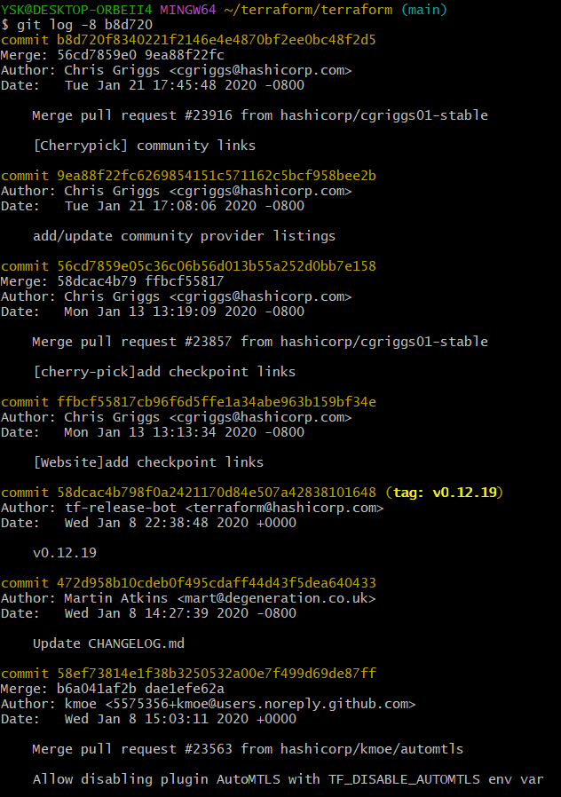
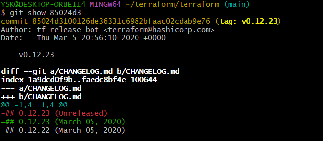
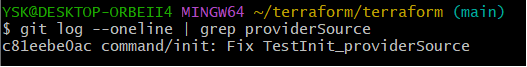
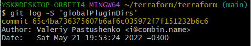

# Домашнее задание к занятию «Инструменты Git»

1. Найдем коммит по началу хэша с помошью (команды `git show`)

Как можем видеть команда показала нам коммит начало хэша которого соответствует (aefea), так же мы можем видеть комментарий этого коммита, и прочую информацию.
2. Что бы найти родителей коммита введем (команду `git log`)

Как можем наблюдать команда показала всех родителей коммита в колл-ве 8ми.
3. Что бы найти тег, коммит которого начинается на (85024d3), так же введем (команду `git show`)

Как можем видеть команда показала нам коммит, его хэш, комментарий и тэг.
Тег коммита: v0.12.23.
4. Что бы перечислить хэши и комментарии всех коммитов в промежутке тегов, нам необходимо прописать (команду `git log`) и задать необходимый нам интервал.

Листая вниз можем наблюдать все коммиты и их хэши:  

commit b14b74c4939dcab573326f4e3ee2a62e23e12f89
[Website] vmc provider links;
 итд.
5. Что бы найти коммит в котором была создана функция "providerSource" введем команду `git log --oneline | grep` опция grep показывает коммиты в которых было упоминание заданного параметра.

видим что хэш коммита в котором была упомянута функция: c81eebe0ac.
6. Так же, что бы найти все коммиты в которых была изменена функция "globalPluginDirs" введем команду `git log -S`

7. Автором функции 'synchronizedWriters' является Martin Atkins