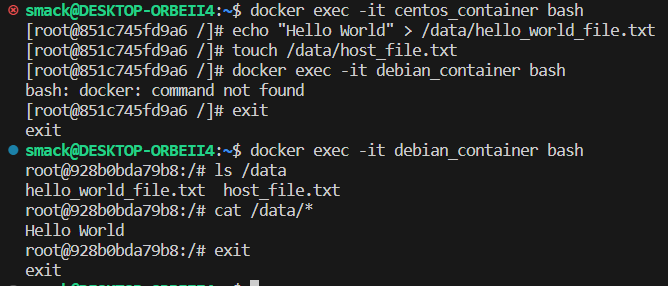

<b>Домашняя работа № 3. «Введение. Экосистема. Архитектура. Жизненный цикл Docker-контейнера» </b>

Задача 1

Сценарий выполнения задачи:
1) свой репозиторий на https://hub.docker.com;
2) выберите любой образ, который содержит веб-сервер Nginx;
3) создайте свой fork образа;
4) реализуйте функциональность: запуск веб-сервера в фоне с индекс-страницей, содержащей HTML-код ниже.

Отправляю ссылку на docker-hub с моим docker images. 

    https://hub.docker.com/repository/docker/smackyan/netology/general

Задача 2

Посмотрите на сценарий ниже и ответьте на вопрос: «Подходит ли в этом сценарии использование Docker-контейнеров или лучше подойдёт виртуальная машина, физическая машина? Может быть, возможны разные варианты?»

Ответ:

    Высоконагруженное монолитное java веб-приложение;
    - физический сервер необходим, так как монолитное приложение не может быть реализовано в микросервисах без изменения кода. Из-за высокой нагрузки требуется непосредственный доступ к ресурсам без использования виртуализации на гипервизоре.

    Nodejs веб-приложение;
    - это веб-приложение может быть хорошо реализовано в контейнерах Докера, и в контексте микросервисной архитектуры это может быть хорошим решением.

    Мобильное приложение c версиями для Android и iOS;
    - виртуальная машина, так как приложение в докере не имеет графического интерфейса, а это не подходит для описанных условий.

    Шина данных на базе Apache Kafka;
    - зависит от передаваемых данных или среды (тестовая/производственная). Для производства и критичных данных лучше виртуальная машина, для теста достаточно контейнерного решения. Если потеря данных при потере контейнера не критична, то можно использовать контейнер.

    Elastic stack для реализации логирования продуктивного веб-приложения - три ноды elasticsearch, два logstash и две ноды kibana;
    - ElasticSearch лучше работает на виртуальной машине, отказоустойчивость обеспечивается на уровне кластера. Kibana и Logstash можно запустить в докере или на виртуальной машине. 

    Мониторинг-стек на базе prometheus и grafana;
    - Grafana имеет ограничение на количество обрабатываемых метрик, и может потребоваться разделение под разные задачи. Ну а в целом можно развернуть в докере.

    Mongodb, как основное хранилище данных для java-приложения;
    - можно использовать виртуальную машину, так как хранилище не указано как высоконагруженное. Хранение базы данных с данными в контейнере не подходит. Использование физического сервера может быть слишком затратным.

Задача 3

    Запустите первый контейнер из образа centos c любым тегом в фоновом режиме, подключив папку /data из текущей рабочей директории на хостовой машине в /data контейнера.

    Запустите второй контейнер из образа debian в фоновом режиме, подключив папку /data из текущей рабочей директории на хостовой машине в /data контейнера.

    Подключитесь к первому контейнеру с помощью docker exec и создайте текстовый файл любого содержания в /data.

    Добавьте ещё один файл в папку /data на хостовой машине.

    Подключитесь во второй контейнер и отобразите листинг и содержание файлов в /data контейнера.

Ответ:

