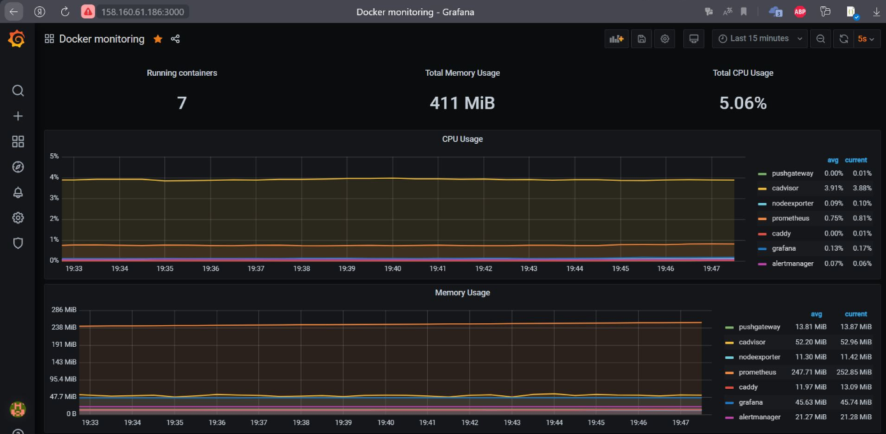

Домашнее задание №4 «Оркестрация группой Docker-контейнеров на примере Docker Compose»

Задача 1

    Создайте собственный образ любой операционной системы (например, debian-11) с помощью Packer версии 1.7.0 . Перед выполнением задания изучите инструкцию. В инструкции указана минимальная версия 1.5, но нужно использовать 1.7, так как там есть нужный нам функционал

    Чтобы получить зачёт, вам нужно предоставить скриншот страницы с созданным образом из личного кабинета YandexCloud.

Ответ:

Задача 2

    Создать вашу первую виртуальную машину в YandexCloud с помощью terraform. Используйте terraform код в директории (src/terraform)

    Для получения зачета, вам необходимо предоставить вывод команды terraform apply и страницы свойств созданной ВМ из личного кабинета YandexCloud

Ответ: 

Задание 3 

    Откройте web браузер, зайдите на страницу http://<внешний_ip_адрес_вашей_ВМ>:3000. Используйте для авторизации логин и пароль из (.env-file). Изучите доступный интерфейс, найдите в интерфейсе автоматически созданные docker-compose панели с графиками(dashboards). Подождите 5-10 минут, чтобы система мониторинга успела накопить данные.

